# Customer Churn Prediction and Retention Planner

A machine learning solution for a telecom company that predicts customer churn,
explains each prediction, finds similar customers who stayed, and recommends
retention actions through an interactive Streamlit dashboard.

```text
Raw telecom data
    -> Cleaning and preprocessing
    -> Churn prediction
    -> Prediction explanation
    -> Customer vectorization
    -> Cosine similarity search
    -> Similar retained customers
    -> Personalized retention plan
```

## Status: complete

All stages are built, tested, and reproducible. The 6 notebooks run top to bottom
with no errors and 69 automated tests pass.

- [x] Stage 1: Raw data understanding (`notebooks/01_raw_data_analysis.ipynb`)
- [x] Stage 2: Cleaning and preprocessing (`notebooks/02_cleaning_preprocessing.ipynb`)
- [x] Stage 3: Model development (`notebooks/03_model_development.ipynb`)
- [x] Stage 4: Explainability (`notebooks/04_model_explanations.ipynb`)
- [x] Stage 5: Customer vectors and similarity (`notebooks/05_customer_similarity.ipynb`)
- [x] Stage 6: Retention planner (`notebooks/06_retention_planner.ipynb`)
- [x] Streamlit dashboard (`app/streamlit_app.py`)

## Results at a glance

| Item | Value |
|---|---|
| Final model | Logistic Regression (chosen on PR-AUC, tie-broken on precision-at-80%-recall) |
| Decision threshold | 0.243 (tuned to catch ~80% of churners) |
| Test recall | 0.82 (catches 308 of 374 churners) |
| Test precision | 0.49 |
| Test ROC-AUC | 0.84 |
| Customers flagged for outreach | ~44% |

This is a deliberate **recall-leaning** trade-off: a missed churner (a lost
customer) is treated as more costly than an unnecessary outreach, so the model
reaches most at-risk customers and accepts that about half of those it flags would
have stayed anyway.

## How it works

### 1. Raw data understanding
7,043 customers, 21 columns. About **26.5% churned**, so the classes are
imbalanced - which is why we never judge the model on accuracy alone.

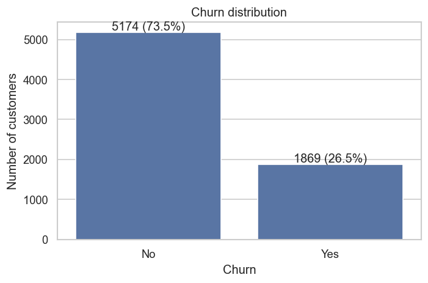

The only real data-quality issue is `TotalCharges`: it arrives as text with 11
blank values, all belonging to brand-new customers (tenure 0). There are no
duplicate rows or duplicate customer IDs.

### 2. Cleaning and preprocessing
`TotalCharges` is converted to numbers (blanks set to 0). The data is split
**60/20/20 (stratified)** *before* any transformation is fit, so scalers and
encoders only ever learn from training data. One `ColumnTransformer` (median
impute + scale for numbers, one-hot encode for categories) becomes the single
preprocessor reused by the model, the similarity search, and the dashboard. We
compared StandardScaler and RobustScaler and chose StandardScaler.

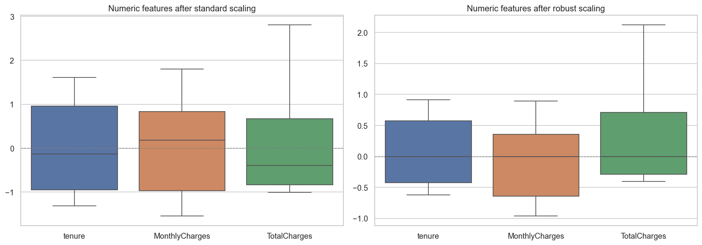

### 3. Model development
Every candidate is a leakage-safe `imblearn` pipeline
(`preprocessor -> [SMOTE] -> classifier`), so SMOTE only runs on training folds.
We compared a dummy baseline, logistic regression, random forest, and XGBoost,
each under three imbalance strategies (original, class weights, SMOTE).

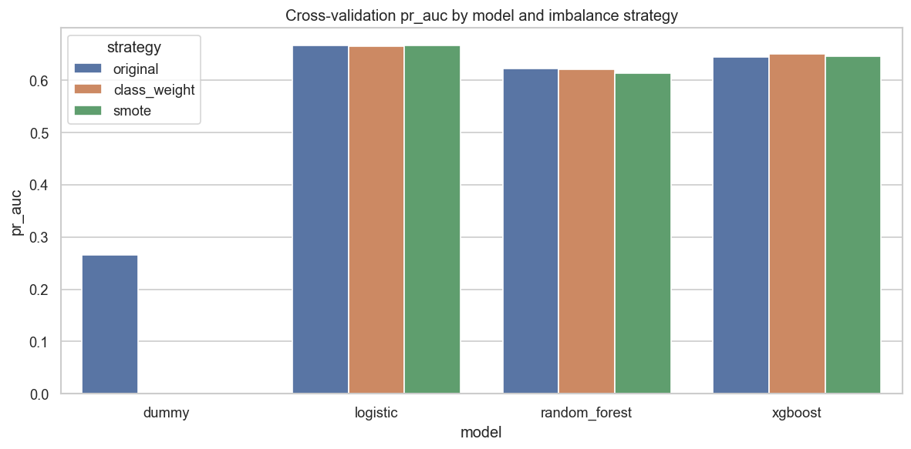

An honest result: **SMOTE and class weights did not improve PR-AUC** on this
dataset. Logistic Regression won on PR-AUC and precision-at-80%-recall, and is the
simplest and best-calibrated choice. The decision threshold is tuned for ~80%
recall.

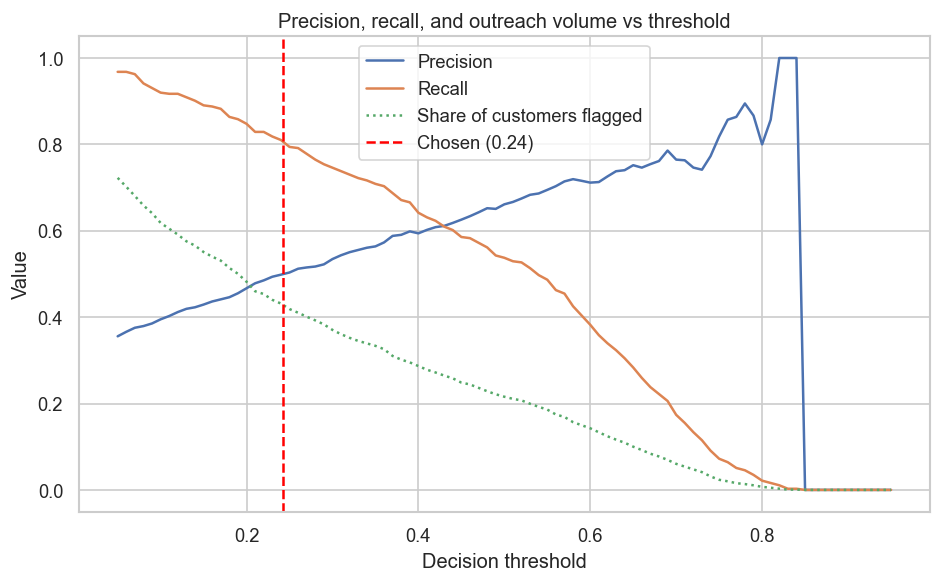
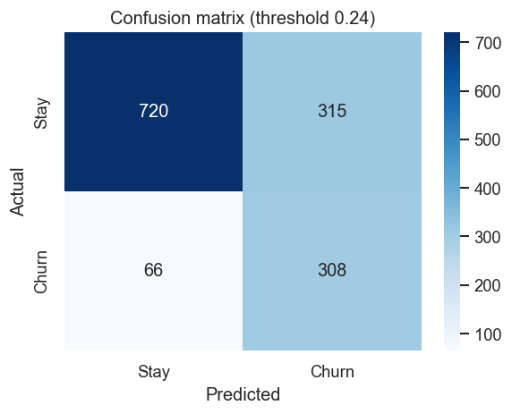
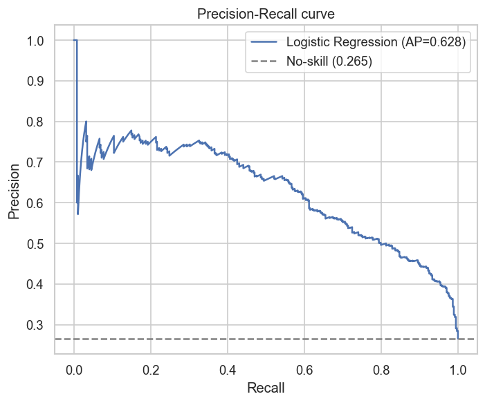

### 4. Explainability
Global coefficients, permutation importance, and SHAP all agree on the main
drivers: **tenure, internet service, contract type, and monthly charges**.

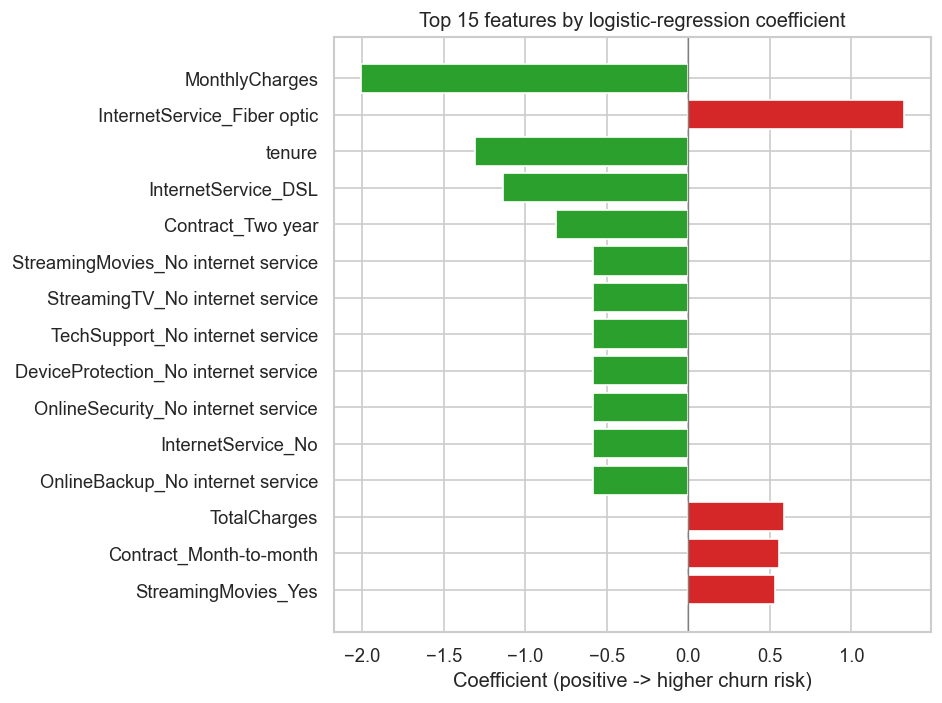
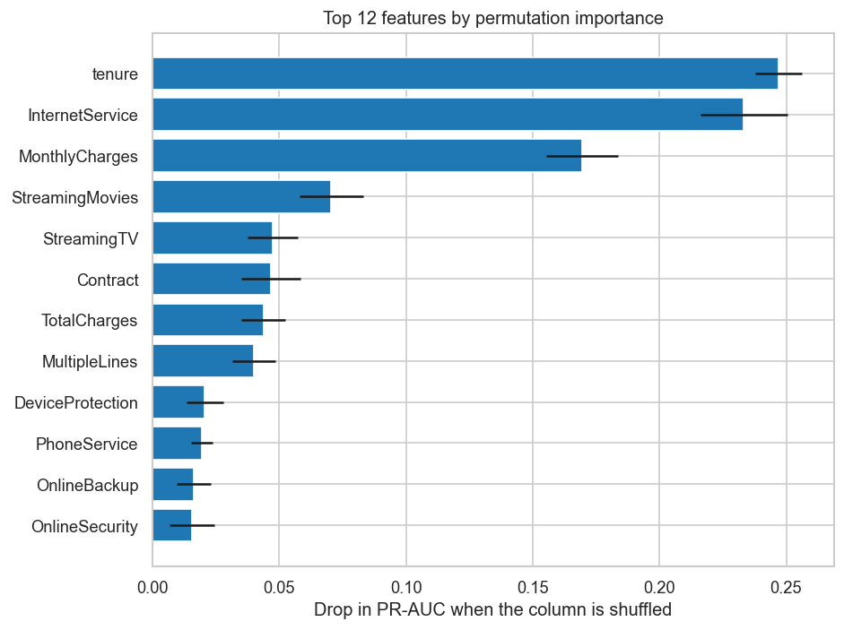
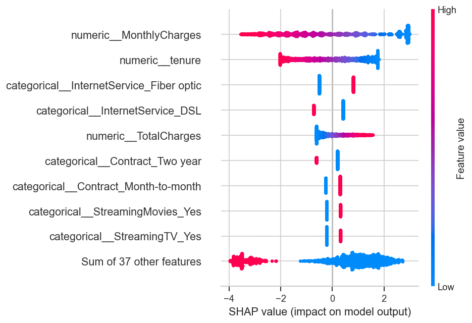

For any single customer, `explain_customer` returns the factors raising and
lowering their risk, in plain language, sorted strongest first.

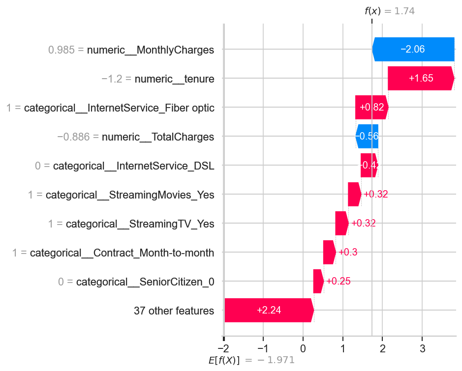

### 5. Customer vectors and similarity
Every customer is turned into a 46-feature vector with the same fitted
preprocessor (the vectors exclude the ID, churn label, and prediction, so the
similarity space has no leakage). Cosine similarity over the **full** vector space
finds the closest customers who **stayed**. The 2D map below is a PCA projection
**for viewing only** - similarity always uses the full vectors.

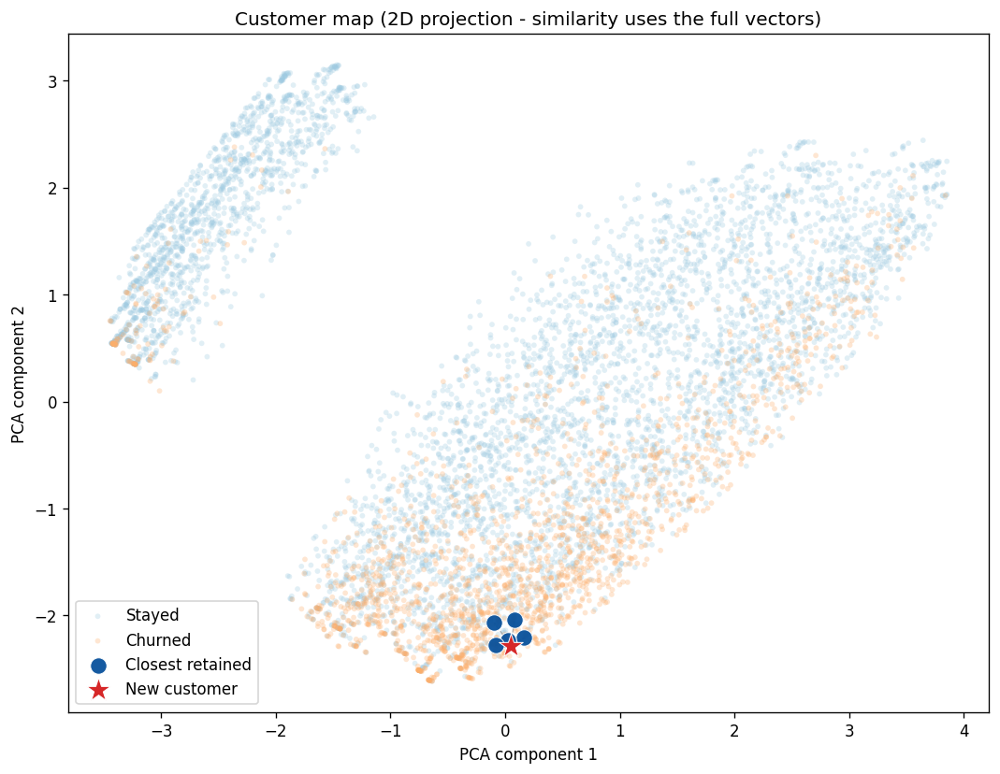

### 6. Retention planner (similarity-driven)
Cosine similarity helps **choose** the actions, not just back them up. The planner
takes the churn probability, the model's per-customer risk factors, and the
**weighted group of up to 20 retained customers** above the similarity threshold
(0.80). A feature becomes a recommendation only when **both** hold: the model flags
it as raising *this* customer's risk, **and** the similar retained customers
commonly have a better, actionable value (similarity-weighted agreement ≥ 60%).
Each recommendation reports the current and suggested value, model evidence,
neighbor agreement, similarity quality, a combined priority score, and a confidence
level. Protected features (gender, senior status, partner, dependents) are never
recommended; short tenure triggers an onboarding/loyalty action. If no neighbors
qualify, it falls back to model-supported actions, clearly labelled.

### 7. The dashboard
A multipage Streamlit app ties it all together: enter a customer, get the
prediction and explanation, see the similarity map, and read the retention plan.
It loads the saved model and artifacts and **never retrains**.

> Dashboard screenshots (prediction results, similarity map, retention plan) can be
> added to `reports/figures/` by running the app and capturing each section.

## Dataset

IBM Telco Customer Churn dataset (`data/raw/WA_Fn-UseC_-Telco-Customer-Churn.csv`):
7,043 customers, 21 columns, target column `Churn`.

## Setup

```bash
python -m venv .venv
.venv\Scripts\activate        # Windows
pip install -r requirements.txt
```

## Run the notebooks

```bash
jupyter notebook notebooks/01_raw_data_analysis.ipynb
```

Run them in order, 01 through 06. Stages 2 and 3 create the saved artifacts in
`models/` that the later stages and the dashboard depend on.

## Run the dashboard

```bash
streamlit run app/streamlit_app.py
```

Open the **Analyze Customer** page, load an example (High risk / Low risk /
Average) or enter a customer, and press **Analyze Customer**. Then view the
**Similarity Map** and **Retention Plan** pages for that customer.

## Run the tests

```bash
pytest
```

## Design principles

- **No data leakage.** The split happens before any transformation is fit; one
  fitted preprocessor is reused everywhere; SMOTE runs only inside training folds.
- **Reusable code in `src/`.** Notebooks demonstrate and explain; they do not hold
  the logic. The dashboard imports the same functions.
- **Honest framing.** Explanations are associations the model learned, not proven
  causes. Recommended actions address risk factors and are not guaranteed to retain
  a customer. The dataset has no record of past offers, so similar retained
  customers are shown as comparable profiles, not proof an offer worked.
- **Plain, readable code.** Small focused functions, descriptive names, minimal
  abstraction.

## Project layout

```text
customer-churn-retention/
├── app/              Streamlit dashboard (streamlit_app.py + pages/ + components/)
├── data/raw/         original dataset (read-only)
├── data/processed/   cleaned data (telco_clean.csv)
├── models/           saved preprocessor, model, and decision threshold
├── notebooks/        one notebook per stage (demonstrates src/ code)
├── reports/figures/  charts saved for this README
├── src/              reusable logic: data, features, models, explainability,
│                     similarity, retention
└── tests/            automated checks (69 tests)
```
